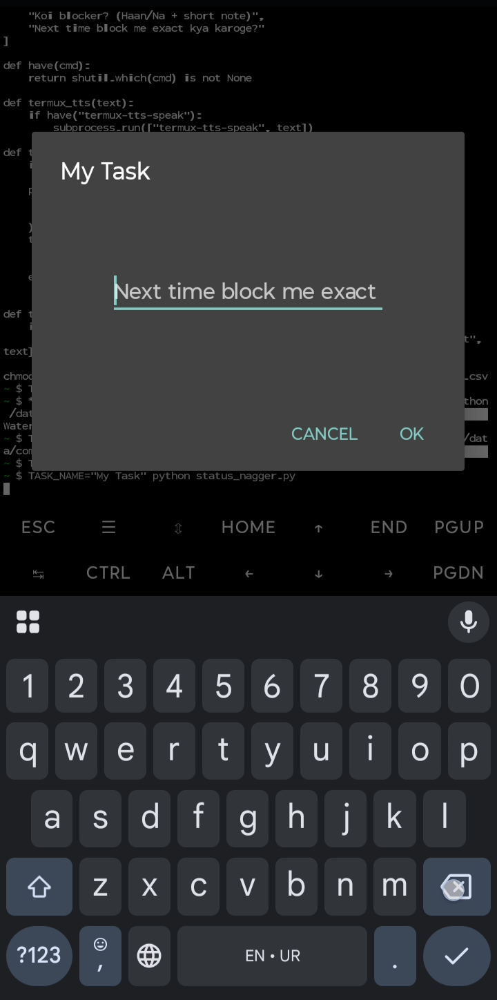
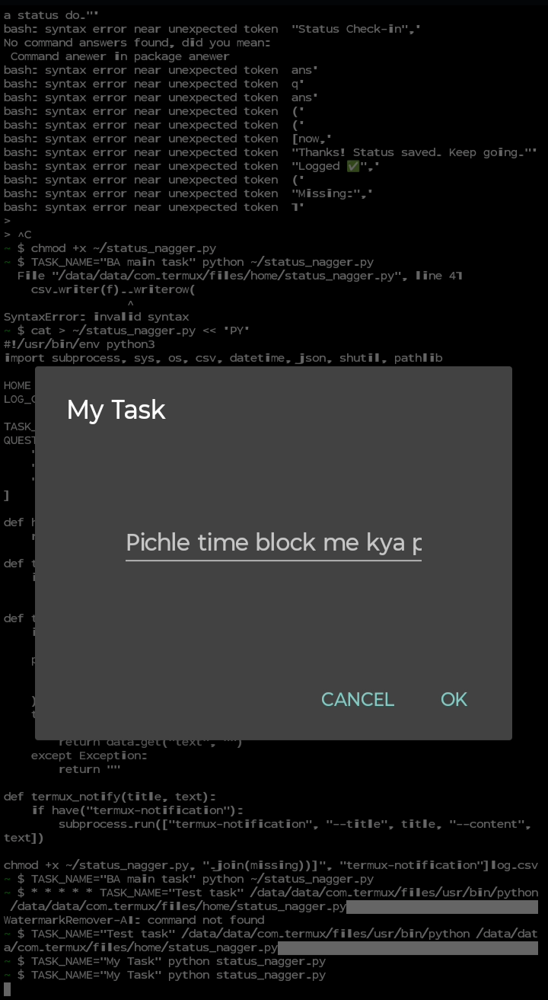

# TRACK-AND-GET-ALERT-VOICE-BASED-IN-YOUR-PHONE
# Voice-based Productivity & Status Tracker 🎙️✅

A personal **voice accountability assistant** built with **Python + Termux + Termux:API**.  
It reminds you to check-in at regular intervals, asks about your progress, and logs everything into a CSV file.

---

## 🚀 Features
- 🔊 **Voice reminders (TTS):** Speaks out loud to remind you to update status.
- 📱 **Interactive dialogs:** Pop-up prompts to log progress, blockers, and next steps.
- 📂 **CSV logging:** All responses are stored in `progress_log.csv` for daily/weekly review.
- 🔔 **Notifications:** Android notifications with status details.
- ⏲️ **Cron scheduling:** Fully automated reminders every 30 minutes (configurable).

---

## 🛠️ Tech Stack
- **Python 3**
- **Termux (Linux on Android)**
- **Termux:API** (for TTS, dialogs, notifications)
- **Cron (task scheduler)**
- **CSV (data logging)**

---

## 📷 Screenshots
<p align="center">
  
  
</p>

---

## 🎥 Demo Video
👉 [Watch the demo](demo/demo.mp4)  

*(Screen-recorded on Android: shows voice reminder, dialog input, and log entry.)*

---

## ⚡ Installation & Setup
1. Install **Termux** + **Termux:API** from F-Droid.  
2. In Termux:
   ```bash
   pkg install python termux-api cronie
   git clone https://github.com/USERNAME/voice-status-tracker.git
   cd voice-status-tracker
   chmod +x status_nagger.py
